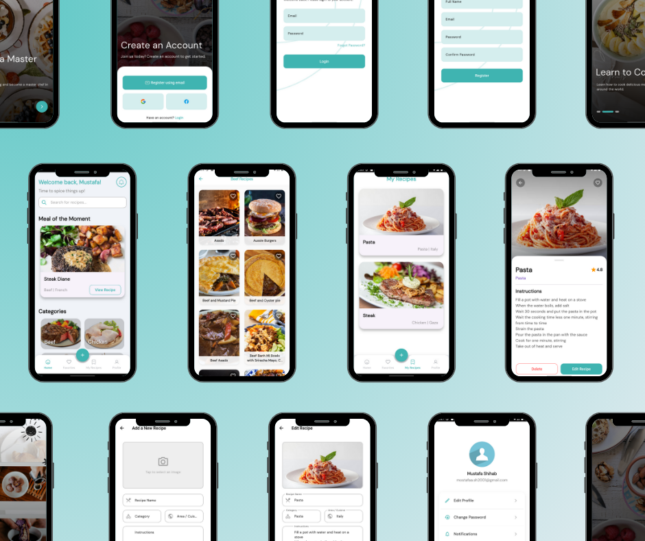

# Recipe App

A feature-rich recipe and meal discovery application built with Flutter. The app allows users to browse, search, and save recipes, manage their own creations, and maintain a list of their favorite meals. It leverages a clean, feature-driven architecture with modern state management and dependency injection.

---

## Table of Contents

- [Features](#features)
- [Architecture](#architecture)
- [ScreenShots](#screenshots)

---

## Features

- **User Authentication**: Secure login and registration using Firebase Authentication.
- **Dynamic Home Screen**: Displays meal categories and other recipe sections fetched from a remote API.
- **Advanced Search**: A dedicated search view for finding recipes by name.
- **Category-Based Filtering**: Users can tap on a category to view all associated recipes.
- **Recipe Details**: A detailed view for each recipe, showing image, instructions, category, and area.
- **Favorites Management**: Users can mark/unmark recipes as favorites, which are persisted locally.
- **My Recipes**: Users can create, view, edit, and delete their own custom recipes, which are stored in a local SQLite database.
- **User Profile**: A clean user profile screen with a secure logout option.

---

## Architecture

The project follows a modern and scalable feature-first architecture, promoting a clean separation of concerns.

- **State Management**: **Cubit** is used to manage the state of the application. The UI is completely decoupled from the business logic, making the app testable and easy to maintain.

- **Dependency Injection**: **GetIt** is used as a service locator to inject dependencies like Cubits, data sources, and services wherever they are needed. This is configured in the `lib/config/dependency_injection.dart` file.

- **Navigation**: Named routes are used for all navigation, managed by a central `RouteGenerator` in `lib/routes/routes.dart`. This provides a single source of truth for all navigation logic.

- **Networking**: The `http` package is used for making API calls to the remote recipe database. API constants are centralized in `lib/core/network/api_constants.dart`.

- **Local Storage**: **SQFlite** is used for local database persistence, primarily for storing user-created recipes and favorites.

- **Authentication**: **Firebase Auth** provides the backend for all user authentication flows.

---

## ScreenShots

